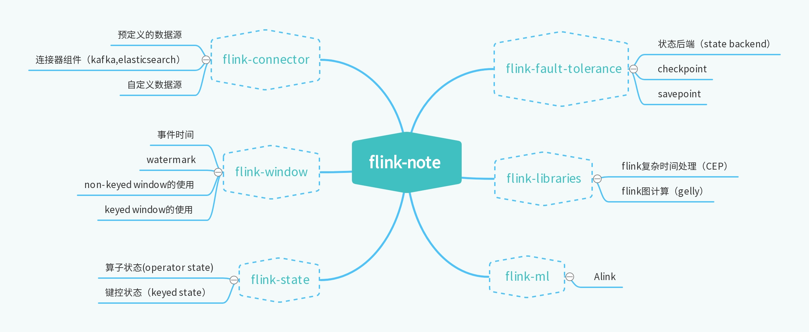
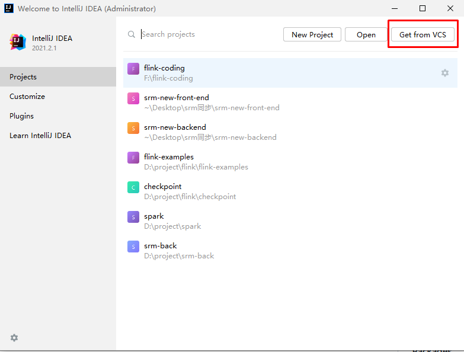
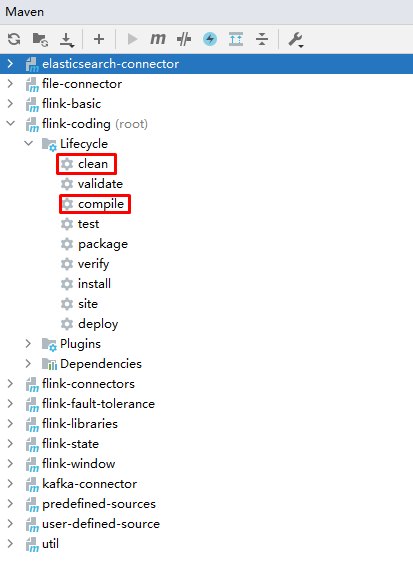

# flink-coding
**基于flink1.15，给出flink各功能的代码实现，帮助开发者快速学习flink**。

<!-- the line below needs to be an empty line C: (its because kramdown isnt
     that smart and dearly wants an empty line before a heading to be able to
     display it as such, e.g. website) -->

[comment]: <> (![Java CI]&#40;https://github.com/iluwatar/java-design-patterns/workflows/Java%20CI/badge.svg&#41;)

[comment]: <> ([![Lines of Code]&#40;https://sonarcloud.io/api/project_badges/measure?project=iluwatar_java-design-patterns&metric=ncloc&#41;]&#40;https://sonarcloud.io/dashboard?id=iluwatar_java-design-patterns&#41;)

<!-- ALL-CONTRIBUTORS-BADGE:END -->

# 介绍

Apache Flink 是一个在有界数据流和无界数据流上进行有状态计算分布式处理引擎和框架。Flink 设计旨在所有常见的集群环境中运行，以任意规模和内存级速度执行计算。

作为apache的顶级项目之一，flink的更新迭代非常快。短短一年事件内，就完成了从version 1.12到version 1.15的更新迭代。与此同时，很多api接口、架构方式等都发生了变化。
我注意到现在市面上的flink学习资料都比较陈旧。例如说，很多教程中自定义数据源还在使用已经过时的`sourceFunction`。因此，本项目旨在探究最新的flink api接口、其背后的架构。

# Getting started
本项目基于maven构建，在这里示范一下使用idea构建项目的流程：
1. 使用idea下载项目：

2. 在idea右侧找到maven选项卡，打开`flink-coding`模块，先点clean，clean完成之后点compile

3. 在maven构建完成之后，项目中的代码就可以运行了。

# 参与贡献
如果想要参与贡献，欢迎pull requests，也可以在issues区提出问题，我下班之后都会看的。

# License
本项目使用MIT license。
