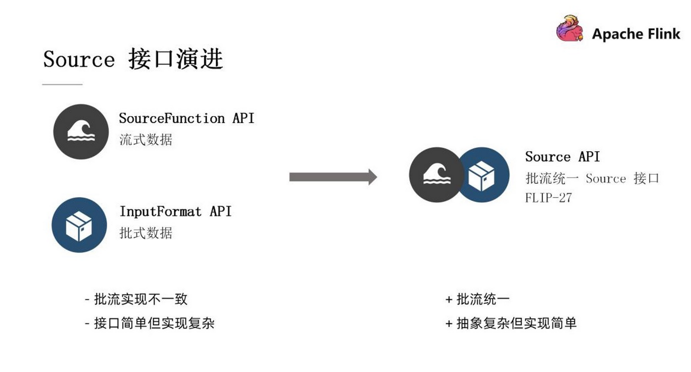

# flink sources & sinks

## source
flink的source可以分为以下三类：
1. 预定义的data sources： 
   - 这类sources是flink原生支持的，例如从集合、文件、socket中读取数据流。
    ```
    StreamExecutionEnvironment env = StreamExecutionEnvironment.getExecutionEnvironment();
    DataStreamSource<Car> carDataStreamSource = env.fromCollection(···);
    DataStreamSource<String> textFileSource = env.readTextFile(···);
    DataStreamSource<String> socketTextStream = env.socketTextStream("ubuntu", 12345);
    ```
    - 本项目中对应的模块是：
      - 🚀 `predefined-sources`
---
2. flink提供的连接器组件：
   - 想要从这类sources中读取数据流需要引入依赖。
   例如为了支持从kafka等外部系统中进行读取、写入，我们需要先导入maven依赖：
    ```
    <dependency>
        <groupId>org.apache.flink</groupId>
        <artifactId>flink-connector-kafka_2.11</artifactId>
        <version>1.14.4</version>
    </dependency>
    ```
   - 本项目中对应的模块是：
     - 🚀 `file-connector`
     - 🚀 `kafka-connector`
     - 🚀 `elasticsearch-connector`
---
3. 自定义dataSource 
   - 有时候我们想要自定义如何生成DataStream，这时候就需要自定义DataSource。flink在1.10之前我们只需要继承`SourceFunction`，重写其`run`方法就可以自定义DataSource，但是这种
方式具有一些弊端，在1.10之后，flink重构了自定义DataSource的接口：

   - 项目中对应的模块是：
     - 🚀 `user-defined-source`