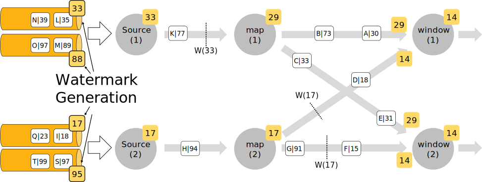

# flink-window模块
包含的知识点有：
## 1. flink事件时间的生成，watermark的生成 [watermark生成](https://nightlies.apache.org/flink/flink-docs-release-1.15/zh/docs/dev/datastream/event-time/generating_watermarks/)
> ##### 概述
>为了使用事件时间语义，Flink 应用程序需要知道事件时间戳对应的字段，意味着数据流中的每个元素都需要拥有可分配的事件时间戳。其通常通过使用 TimestampAssigner API 从元素中的某个字段去访问/提取时间戳。
>
> 时间戳的分配与 watermark 的生成是齐头并进的，其可以告诉 Flink 应用程序事件时间的进度。其可以通过指定 WatermarkGenerator 来配置 watermark 的生成方式。
>
>使用 Flink API 时需要设置一个同时包含 TimestampAssigner 和 WatermarkGenerator 的 WatermarkStrategy。WatermarkStrategy 工具类中也提供了许多常用的 watermark 策略，并且用户也可以在某些必要场景下构建自己的 watermark 策略。WatermarkStrategy 接口如下：
```
public interface WatermarkStrategy<T> 
    extends TimestampAssignerSupplier<T>, WatermarkGeneratorSupplier<T>{

    /**
     * 根据策略实例化一个可分配时间戳的 {@link TimestampAssigner}。
     */
    @Override
    TimestampAssigner<T> createTimestampAssigner(TimestampAssignerSupplier.Context context);

    /**
     * 根据策略实例化一个 watermark 生成器。
     */
    @Override
    WatermarkGenerator<T> createWatermarkGenerator(WatermarkGeneratorSupplier.Context context);
}

```
> 如上所述，通常情况下，你不用实现此接口，而是可以使用 WatermarkStrategy 工具类中通用的 watermark 策略，或者可以使用这个工具类将自定义的 TimestampAssigner 与 WatermarkGenerator 进行绑定。例如，你想要要使用有界无序（bounded-out-of-orderness）watermark 生成器和一个 lambda 表达式作为时间戳分配器，那么可以按照如下方式实现：
```
WatermarkStrategy
        .<Tuple2<Long, String>>forBoundedOutOfOrderness(Duration.ofSeconds(20))
        .withTimestampAssigner((event, timestamp) -> event.f0);

```
---
> ##### 使用 Watermark 策略
> WatermarkStrategy 可以在 Flink 应用程序中的两处使用，第一种是直接在数据源上使用，第二种是直接在非数据源的操作之后使用。
> 
> 第一种方式相比会更好，因为数据源可以利用 watermark 生成逻辑中有关分片/分区（shards/partitions/splits）的信息。使用这种方式，数据源通常可以更精准地跟踪 watermark，整体 watermark 生成将更精确。直接在源上指定 WatermarkStrategy 意味着你必须使用特定数据源接口，参阅 Watermark 策略与 Kafka 连接器以了解如何使用 Kafka Connector，以及有关每个分区的 watermark 是如何生成以及工作的。
> 
> 仅当无法直接在数据源上设置策略时，才应该使用第二种方式（在任意转换操作之后设置 WatermarkStrategy）：
```
final StreamExecutionEnvironment env = StreamExecutionEnvironment.getExecutionEnvironment();

DataStream<MyEvent> stream = env.readFile(
        myFormat, myFilePath, FileProcessingMode.PROCESS_CONTINUOUSLY, 100,
        FilePathFilter.createDefaultFilter(), typeInfo);

DataStream<MyEvent> withTimestampsAndWatermarks = stream
        .filter( event -> event.severity() == WARNING )
        .assignTimestampsAndWatermarks(<watermark strategy>);

withTimestampsAndWatermarks
        .keyBy( (event) -> event.getGroup() )
        .window(TumblingEventTimeWindows.of(Time.seconds(10)))
        .reduce( (a, b) -> a.add(b) )
        .addSink(...);
```

---
> ##### 处理空闲数据源
> 如果数据源（比如kafka）中的某一个分区/分片在一段时间内未发送事件数据，则意味着 WatermarkGenerator 也不会获得任何新数据去生成 watermark。
> 我们称这类数据源为空闲输入或空闲源。
> 在这种情况下，当某些其他分区仍然发送事件数据的时候就会出现问题。
> 由于下游算子 watermark 的计算方式是取所有不同的上游并行数据源 watermark 的最小值，则其 watermark 将不会发生变化。
> 
> 举例子说，kafka的topic有4个partition，其中有1个partition没有来新数据，其他三个都在正常产生新数据。
> 那么由于那一个partition没有数据来，没有触发那个分区source的watermark更新。那么由于下游算子的watermark是去上游watermark中最小的哪一个，因此下游的watermark也不会更新，无法触发计算等。
> 
> 为了解决这个问题，你可以使用 WatermarkStrategy 来检测空闲输入并将其标记为空闲状态。WatermarkStrategy 为此提供了一个工具接口：
```
WatermarkStrategy
        .<Tuple2<Long, String>>forBoundedOutOfOrderness(Duration.ofSeconds(20))
        .withIdleness(Duration.ofMinutes(1));
```
>这样的话，如果一个partition超过一分钟没来数据，我们就会把其标注为空闲状态，其不会对下游watermark造成影响。
> 
---
> **watermark的传递策略**
> 
> 上游算子的watermark在计算中需要传递给下游算子，传递规则是：下游算子的watermark是上游算子中watermark最小的那一个。
> 这种传递规则是很好理解的，因为watermark标志的是再次之前的数据已经完全到来，所以上有算子中最小的watermark代表着所有上游算子的共识，
> 因为所有上游算子都认为在这个watermark之前的数据已经全部到来了。
> watermark的传递规则有时候会导致一些令人费解的现象：比如在一个并行度为3的flink程序中，我们先从kafka中读取source，
> 然后进行shuffle做一些计算，最后将结果sink出去。假设有一个source的watermark拖后腿了，那么三个计算算子的watermark
> 都会滞后，可能会导致窗口不被fire，因此，sink中将不输出任何结果。
> 在`flink-window/src/main/java/com/wxwmd/window/watermark/WatermarkPass.java`中，展示了watermark
> 传递的例子。




---
## 2. flink window的分类及其应用
 > 窗口（Window）是处理无界流的关键所在。窗口可以将数据流装入大小有限的“桶”中，再对每个“桶”加以处理。 本文的重心将放在 Flink 如何进行窗口操作以及开发者如何尽可能地利用 Flink 所提供的功能。
 > 
> 下面展示了 Flink 窗口在 keyed streams 和 non-keyed streams 上使用的基本结构。 我们可以看到，这两者唯一的区别仅在于：keyed streams 要调用 keyBy(...)后再调用 window(...) ， 而 non-keyed streams 只用直接调用 windowAll(...)。留意这个区别，它能帮我们更好地理解后面的内容。
> 
```
# keyed stream window的使用
stream
       .keyBy(...)               <-  仅 keyed 窗口需要
       .window(...)              <-  必填项："assigner"
      [.trigger(...)]            <-  可选项："trigger" (省略则使用默认 trigger)
      [.evictor(...)]            <-  可选项："evictor" (省略则不使用 evictor)
      [.allowedLateness(...)]    <-  可选项："lateness" (省略则为 0)
      [.sideOutputLateData(...)] <-  可选项："output tag" (省略则不对迟到数据使用 side output)
       .reduce/aggregate/apply()      <-  必填项："function"
      [.getSideOutput(...)]      <-  可选项："output tag"
      
# Non-Keyed window的使用
stream
       .windowAll(...)           <-  必填项："assigner"
      [.trigger(...)]            <-  可选项："trigger" (else default trigger)
      [.evictor(...)]            <-  可选项："evictor" (else no evictor)
      [.allowedLateness(...)]    <-  可选项："lateness" (else zero)
      [.sideOutputLateData(...)] <-  可选项："output tag" (else no side output for late data)
       .reduce/aggregate/apply()      <-  必填项："function"
      [.getSideOutput(...)]      <-  可选项："output tag"
```
> 上面方括号（[…]）中的命令是可选的。也就是说，Flink 允许你自定义多样化的窗口操作来满足你的需求。
> 
---
窗口的生命周期
> 简单来说，一个窗口在第一个属于它的元素到达时就会被创建，然后在时间（event 或 processing time） 超过窗口的“结束时间戳 + 用户定义的 allowed lateness （详见 Allowed Lateness）”时 被完全删除。Flink 仅保证删除基于时间的窗口，其他类型的窗口不做保证， 比如全局窗口（详见 Window Assigners）。 例如，对于一个基于 event time 且范围互不重合（滚动）的窗口策略， 如果窗口设置的时长为五分钟、可容忍的迟到时间（allowed lateness）为 1 分钟， 那么第一个元素落入 12:00 至 12:05 这个区间时，Flink 就会为这个区间创建一个新的窗口。 当 **watermark** 越过 12:06 时，这个窗口将被摧毁。
>
> 另外，每个窗口会设置自己的 **Trigger** （详见 Triggers）和 **function** (ProcessWindowFunction、ReduceFunction、或 AggregateFunction， 详见 Window Functions）。
> **该 function 决定如何计算窗口中的内容， 而 Trigger 决定何时窗口中的数据可以被 function 计算。** Trigger 的触发（fire）条件可能是“当窗口中有多于 4 条数据”或“当 watermark 越过窗口的结束时间”等。 Trigger 还可以在 window 被创建后、删除前的这段时间内定义何时清理（purge）窗口中的数据。 这里的数据仅指窗口内的元素，不包括窗口的 meta data。也就是说，窗口在 purge 后仍然可以加入新的数据。
> 
---
Keyed 和 Non-Keyed Windows
> 首先必须要在定义窗口前确定的是你的 stream 是 keyed 还是 non-keyed。 keyBy(...) 会将你的无界 stream 分割为逻辑上的 keyed stream。 如果 keyBy(...) 没有被调用，你的 stream 就不是 keyed。
> 
> 对于 keyed stream，其中数据的任何属性都可以作为 key （详见此处）。 使用 keyed stream 允许你的窗口计算由多个 task 并行，因为每个逻辑上的 keyed stream 都可以被单独处理。 属于同一个 key 的元素会被发送到同一个 task。
> 
> 对于 non-keyed stream，原始的 stream 不会被分割为多个逻辑上的 stream， 所以所有的窗口计算会被同一个 task 完成，也就是 parallelism 为 1。
> 
> 
---

## Window Assigners（各种窗口）
> 指定了你的 stream 是否为 keyed 之后，下一步就是定义 window assigner。
> 
> Window assigner 定义了 stream 中的元素如何被分发到各个窗口。 
> 你可以在 window(...)（用于 keyed streams）或 windowAll(...) （用于 non-keyed streams）中指定一个 WindowAssigner。
> **WindowAssigner 负责将 stream 中的每个数据分发到一个或多个窗口中。** 
> Flink 为最常用的情况提供了一些定义好的 window assigner，也就是 tumbling windows、 sliding windows、 session windows 和 global windows。 
> 你也可以继承 WindowAssigner 类来实现自定义的 window assigner。 
> 所有内置的 window assigner（除了 global window）都是基于时间分发数据的，processing time 或 event time 均可。
> 请阅读我们对于 event time 的介绍来了解这两者的区别， 以及 timestamp 和 watermark 是如何产生的。
> 
> 基于时间的窗口用 start timestamp（包含）和 end timestamp（不包含）描述窗口的大小。 在代码中，Flink 处理基于时间的窗口使用的是 TimeWindow， 它有查询开始和结束 timestamp 以及返回窗口所能储存的最大 timestamp 的方法 maxTimestamp()。
> 
> 接下来我们会说明 Flink 内置的 window assigner 如何工作，以及他们如何用在 DataStream 程序中。 下面的图片展示了每种 assigner 如何工作。 紫色的圆圈代表 stream 中按 key 划分的元素（本例中是按 user 1、user 2 和 user 3 划分）。 x 轴表示时间的进展。
> 
>
---
### 滚动窗口（Tumbling Windows）
> 滚动窗口的 assigner 分发元素到指定大小的窗口。滚动窗口的大小是固定的，且各自范围之间不重叠。 比如说，如果你指定了滚动窗口的大小为 5 分钟，那么每 5 分钟就会有一个窗口被计算，且一个新的窗口被创建（如下图所示）。
> 

> 下面的代码展示了如何使用滚动窗口。
```
DataStream<T> input = ...;

// 滚动 event-time 窗口
// 时间间隔可以用 Time.milliseconds(x)、Time.seconds(x)、Time.minutes(x) 等来指定。
input
    .keyBy(<key selector>)
    .window(TumblingEventTimeWindows.of(Time.seconds(5)))
    .<windowed transformation>(<window function>);

// 滚动 processing-time 窗口
input
    .keyBy(<key selector>)
    .window(TumblingProcessingTimeWindows.of(Time.seconds(5)))
    .<windowed transformation>(<window function>);

// 长度为一天的滚动 event-time 窗口， 偏移量为 -8 小时。
input
    .keyBy(<key selector>)
    .window(TumblingEventTimeWindows.of(Time.days(1), Time.hours(-8)))
    .<windowed transformation>(<window function>);
    
// 常用的window function
aggregate(AggregateFunction<T, ACC, R> function)
如其函数名所示，这个函数的作用是将一个窗口内的所有元素经过某种转换（自定义），之后得到一个结果值
这个函数是增量计算的，也就是说来窗口内来一个元素计算一次，完了窗口触发后在结果流中产生一个结果

process(ProcessFunction<T, R> processFunction)
这个函数就比aggregate更灵活一些，其在一个窗口应用这个函数可以产生一个或多个结果

```
windows function的解析详见 [windows function详解](https://blog.csdn.net/cobracanary/article/details/125222975)

> 我看窗口的时候一直有个疑问： 我只设置了窗口的尺寸，那么窗口的开始时间到结束时间是怎么产生的呢？比方说我设置了1h的窗口，那么产生的窗口是北京时间12:00~13:00还是12:30~13:30呢？
> 
> 如上一个例子所示，滚动窗口的 assigners 也可以传入可选的 offset 参数。
> 这个参数可以用来对齐窗口。
> 比如说，不设置 offset 时，长度为一小时的滚动窗口会与 linux 的 epoch 对齐。
> 你会得到如 1:00:00.000 - 1:59:59.999、2:00:00.000 - 2:59:59.999 等。 
> 如果你想改变对齐方式，你可以设置一个 offset。如果设置了 15 分钟的 offset，
> 你会得到 1:15:00.000 - 2:14:59.999、2:15:00.000 - 3:14:59.999 等。
> 一个重要的 offset 用例是根据 UTC-0 调整窗口的时差。比如说，如果窗口大小是在`Time.days(1)`，中国你可能会设置 offset 为 Time.hours(-8)。
> 因为中国是东八区嘛，如果不设置这个offest，那么你生成的窗口将是`t-1:8:00 ~ t:8:00`，对于一些日活等任务来说，这样就统计错了。
> 
---